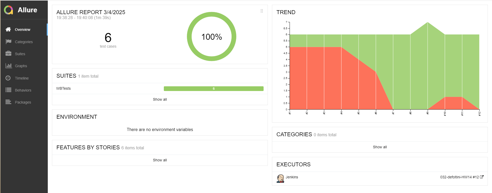

# Проект по автоматизации тестирования для компании [Wildberries](https://www.wildberries.ru/).

> Wildberries — крупнейшая торговая площадка России для покупки и продажи товаров.

## **Содержание:**

____

* <a href="#tools">Технологии и инструменты</a>

* <a href="#cases">Примеры автоматизированных тест-кейсов</a>

* <a href="#jenkins">Пример сборки в Jenkins</a>

* <a href="#console">Запуск из терминала</a>

* <a href="#allure">Allure отчет</a>

* <a href="#telegram">Уведомление в Telegram при помощи бота</a>

* <a href="#gif">Примеры выполнения тестов на Selenoid</a>
____
<a id="tools"></a>
## <a name="Технологии и инструменты">**Технологии и инструменты:**</a>

<p align="center">  
<a href="https://www.jetbrains.com/idea/"></a>  
<a href="https://www.java.com/"></a>  
<a href="https://github.com/"></a>  
<a href="https://junit.org/junit5/"></a>  
<a href="https://gradle.org/"></a>  
<a href="https://selenide.org/"></a>  
<a href="https://aerokube.com/selenoid/"></a>  
<a href="ht[images](images)tps://github.com/allure-framework/allure2"></a>   
<a href="https://www.jenkins.io/"></a>  
<a href="https://www.atlassian.com/ru/software/jira/"></a>  
</p>

____

<a id="cases"></a>  
## <a name="Примеры автоматизированных тест-кейсов"><strong>Примеры автоматизированных тест-кейсов:</strong></a>  


- Проверка регистрации по номеру телефона
- Проверка на регистрацию с невалидным номером телефона
- Проверка регистрации по уже зарегистрированному телефону
- Проверка работы поиска товаров
- Проверка корректности описания карточки товара
- Проверка состояния продуктовой корзины

____


<a id="jenkins"></a>

## </a>Пример сборки в [Jenkins](https://jenkins.autotests.cloud/job/032-defoltini-HW14/10/):</a>

<p align="center">  
<a href="https://jenkins.autotests.cloud/job/032-defoltini-HW14/10/"></a>  
</p>


____

<a id="console"></a>  
## <a name="Запуск из терминала"><strong>Запуск из терминала:</strong></a>  

***Локальный запуск:***
```bash  
gradle clean smoke
```
```bash  
gradle clean test
```

____

<a id="allure"></a>

## </a> [Allure](https://jenkins.autotests.cloud/job/032-defoltini-HW14/10/allure/) отчет:  </a>

<p align="center">  
<a href="https://jenkins.autotests.cloud/job/032-defoltini-HW14/10/allure/"></a>  
</p>


<p align="center">  
<a href="https://jenkins.autotests.cloud/job/032-defoltini-HW14/10/allure/"></a>  
</p>
____


<a id="telegram"></a>

## <a name="Уведомление в Telegram при помощи бота">**Уведомление в Telegram при помощи бота:**</a>

<p align="center">  
</a>  
</p>

____


<a id="gif"></a>

## <a name="Примеры выполнения тестов на Selenide">**Примеры выполнения тестов на Selenide:**</a>

<p align="center">  
</a>  
</p>

